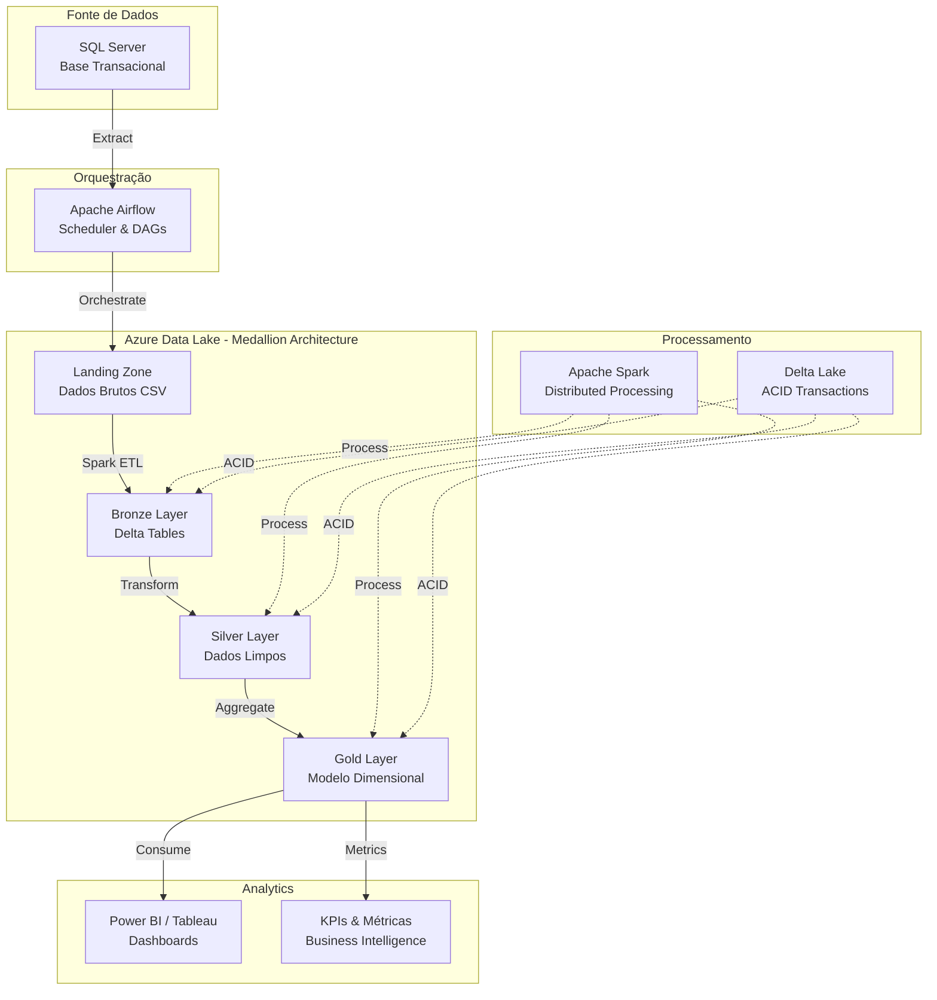

# 🚀 Projeto ETL com Apache Spark & Azure Data Lake

<div align="center">


**Pipeline ETL Moderno para Processamento de Dados em Larga Escala**

[📖 Documentação Completa](https://seu-dominio.github.io/projeto_etl_spark/) • [🚀 Início Rápido](#-início-rápido) • [🏗️ Arquitetura](#️-arquitetura)

</div>

---

## 📋 Índice

- [📖 Sobre o Projeto](#-sobre-o-projeto)
- [🎯 Objetivos](#-objetivos)
- [🏗️ Arquitetura](#️-arquitetura)
- [⚡ Funcionalidades](#-funcionalidades)
- [🛠️ Tecnologias](#️-tecnologias)
- [🚀 Início Rápido](#-início-rápido)
- [📁 Estrutura do Projeto](#-estrutura-do-projeto)
- [🔧 Configuração](#-configuração)
- [📊 Pipeline de Dados](#-pipeline-de-dados)
- [🧪 Testes](#-testes)
- [📈 Monitoramento](#-monitoramento)
- [🤝 Contribuição](#-contribuição)
- [👥 Equipe](#-equipe)
- [📄 Licença](#-licença)

---

## 📖 Sobre o Projeto

Este projeto implementa um **pipeline ETL moderno e escalável** que extrai dados de um banco SQL Server, processa e transforma os dados usando Apache Spark, e armazena no Azure Data Lake seguindo a arquitetura **Medallion (Bronze, Silver, Gold)**. Todo o processo é orquestrado pelo Apache Airflow com containerização Docker.

### 🎯 Contexto de Negócio

O projeto simula um sistema de **logística e transporte**, processando dados de:
- 👥 Clientes e motoristas
- 🚛 Veículos e frotas
- 📦 Entregas e coletas
- 🛣️ Rotas e trajetos
- 🔧 Manutenções e abastecimentos
- 🚨 Multas e infrações

---

## 🎯 Objetivos

- ✅ **Extrair** dados do SQL Server de forma eficiente
- ✅ **Armazenar** dados no Azure Data Lake com organização em camadas
- ✅ **Processar** dados com Apache Spark usando Delta Lake
- ✅ **Transformar** dados seguindo melhores práticas de qualidade
- ✅ **Automatizar** todo o pipeline com Apache Airflow
- ✅ **Monitorar** execuções e performance
- ✅ **Implementar** modelo dimensional para analytics

---

## 🏗️ Arquitetura



---

## ⚡ Funcionalidades

### 🔄 Pipeline ETL Completo
- **Extração incremental** do SQL Server
- **Processamento distribuído** com Spark
- **Transformações de qualidade** de dados
- **Modelo dimensional** para analytics

### 📊 Camadas de Dados (Medallion)
- **🥉 Bronze**: Dados brutos em formato Delta
- **🥈 Silver**: Dados limpos e padronizados
- **🥇 Gold**: Modelo dimensional e KPIs

### 🎛️ Orquestração Avançada
- **DAGs parametrizáveis** no Airflow
- **Retry automático** em caso de falhas
- **Notificações** de status
- **Monitoramento** em tempo real

### 📈 Analytics e KPIs
- **Percentual de entregas no prazo**
- **Custo médio de frete por rota**
- **Total de entregas por tipo de veículo**
- **Valor total de frete por cliente**
- **Métricas mensais** de performance

---

## 🛠️ Tecnologias

<table>
<tr>
<td align="center"><strong>Processamento</strong></td>
<td align="center"><strong>Orquestração</strong></td>
<td align="center"><strong>Armazenamento</strong></td>
<td align="center"><strong>Infraestrutura</strong></td>
</tr>
<tr>
<td align="center">
<br/>
Apache Spark 3.x
</td>
<td align="center">
<br/>
Apache Airflow 2.x
</td>
<td align="center">
<br/>
Azure Data Lake
</td>
<td align="center">
<br/>
Docker & Compose
</td>
</tr>
<tr>
<td align="center">
<br/>
Delta Lake
</td>
<td align="center">
<br/>
Python 3.10+
</td>
<td align="center">
<br/>
SQL Server
</td>
<td align="center">
<br/>
Poetry
</td>
</tr>
</table>

---

## 🚀 Início Rápido

### 📋 Pré-requisitos

Certifique-se de ter instalado:

- 🐍 [Python 3.10+](https://www.python.org/downloads/)
- 🐳 [Docker & Docker Compose](https://www.docker.com/)
- ☁️ [Azure CLI](https://learn.microsoft.com/pt-br/cli/azure/install-azure-cli)
- 📦 [Poetry](https://python-poetry.org/docs/#installation)

### ⚡ Instalação em 3 Passos

```bash
# 1. Clone o repositório
git clone https://github.com/seu-usuario/projeto_etl_spark.git
cd projeto_etl_spark

# 2. Instale as dependências
poetry install

# 3. Configure as variáveis de ambiente
cp .env.example .env
# Edite o arquivo .env com suas credenciais
```

### 🔧 Configuração Rápida

1. **Configure o Azure**:
```bash
az login
# Configure suas credenciais no arquivo .env
```

2. **Inicie o Airflow**:
```bash
cd astro
astro dev start
```

3. **Acesse a interface**:
- 🌐 Airflow UI: [http://localhost:8080](http://localhost:8080)
- 👤 Usuário: `admin` / Senha: `admin`

4. **Execute o pipeline**:
- Navegue até a DAG `sqlserver_to_bronze_adls`
- Clique em "Trigger DAG"

---

## 📁 Estrutura do Projeto

```
projeto_etl_spark/
├── 📁 astro/                    # Ambiente Apache Airflow
│   ├── 📁 dags/                 # DAGs de orquestração
│   │   └── 📄 main.py           # Pipeline principal ETL
│   ├── 📁 tests/                # Testes automatizados
│   ├── 📁 include/              # Arquivos auxiliares
│   ├── 📄 Dockerfile            # Imagem customizada Airflow
│   └── 📄 requirements.txt      # Dependências Python
│
├── 📁 data/                     # Scripts de processamento
│   ├── 📁 bronze/               # Camada Bronze (dados brutos)
│   ├── 📁 silver/               # Camada Silver (dados limpos)
│   ├── 📁 gold/                 # Camada Gold (modelo dimensional)
│   ├── 📁 landingzone/          # Scripts de extração
│   ├── 📁 sql/                  # Scripts SQL
│   ├── 📄 faker_data.py         # Gerador de dados sintéticos
│   └── 📄 create_tables.py      # Criação de tabelas
│
├── 📁 docs/                     # Documentação MkDocs
│   ├── 📁 assets/               # Imagens e diagramas
│   ├── 📄 index.md              # Página inicial
│   ├── 📄 instalacao.md         # Guia de instalação
│   ├── 📄 pipeline_etl.md       # Documentação do pipeline
│   └── 📄 arquitetura.md        # Documentação da arquitetura
│
├── 📁 iac/                      # Infrastructure as Code
│   ├── 📄 main.tf               # Recursos Azure (Terraform)
│   ├── 📄 variables.tf          # Variáveis Terraform
│   └── 📄 provider.tf           # Providers Terraform
│
├── 📄 pyproject.toml            # Configuração Poetry
├── 📄 mkdocs.yml                # Configuração MkDocs
├── 📄 README.md                 # Este arquivo
└── 📄 .env.example              # Exemplo de variáveis de ambiente
```

---

## 🔧 Configuração

### 🔐 Variáveis de Ambiente

Crie um arquivo `.env` baseado no `.env.example`:

```bash
# Azure Data Lake
ADLS_ACCOUNT_NAME=seu_storage_account
ADLS_FILE_SYSTEM_NAME=landing
ADLS_BRONZE_CONTAINER_NAME=bronze
ADLS_SILVER_CONTAINER_NAME=silver
ADLS_GOLD_CONTAINER_NAME=gold
ADLS_SAS_TOKEN=seu_sas_token

# SQL Server
SQL_SERVER=seu_servidor.database.windows.net
SQL_DATABASE=seu_database
SQL_SCHEMA=dbo
SQL_USERNAME=seu_usuario
SQL_PASSWORD=sua_senha

# Spark Configuration
SPARK_DRIVER_MEMORY=4g
SPARK_EXECUTOR_MEMORY=4g
SPARK_EXECUTOR_CORES=2
```

### ⚙️ Configuração do Spark

O projeto inclui configurações otimizadas do Spark:

```python
spark = SparkSession.builder \
    .appName("projeto_etl_spark") \
    .config("spark.sql.extensions", "io.delta.sql.DeltaSparkSessionExtension") \
    .config("spark.sql.catalog.spark_catalog", "org.apache.spark.sql.delta.catalog.DeltaCatalog") \
    .config("spark.jars.packages", "io.delta:delta-core_2.12:2.3.0") \
    .config("spark.driver.memory", "4g") \
    .config("spark.executor.memory", "4g") \
    .config("spark.sql.adaptive.enabled", "true") \
    .getOrCreate()
```

---

## 📊 Pipeline de Dados

### 🔄 Fluxo de Execução

1. **🔍 Landing Zone**: Extração dos dados do SQL Server para CSV
2. **🥉 Bronze Layer**: Ingestão dos CSVs em formato Delta
3. **🥈 Silver Layer**: Limpeza, padronização e qualidade dos dados
4. **🥇 Gold Layer**: Modelo dimensional e cálculo de KPIs

### 📈 KPIs Calculados

| KPI | Descrição | Frequência |
|-----|-----------|------------|
| **On-Time Delivery** | % de entregas realizadas no prazo | Diário |
| **Custo por Rota** | Custo médio de frete por rota | Semanal |
| **Utilização da Frota** | Total de entregas por tipo de veículo | Mensal |
| **Revenue por Cliente** | Valor total de frete por cliente | Mensal |

### 🎯 Modelo Dimensional

```
Fato_Entregas
├── Dim_Data (Tempo)
├── Dim_Cliente (Remetente/Destinatário)
├── Dim_Motorista
├── Dim_Veiculo
├── Dim_Rota
└── Dim_Tipo_Carga
```

---

## 🧪 Testes

Execute os testes automatizados:

```bash
# Testes unitários
poetry run pytest astro/tests/

# Testes de integração
poetry run pytest astro/tests/test_dag_example.py

# Teste de conexão SQL Server
poetry run python astro/tests/test_sqlserver_connection.py
```

### 📊 Cobertura de Testes

- ✅ Testes de DAGs
- ✅ Testes de conexão com SQL Server
- ✅ Testes de transformações Spark
- ✅ Testes de qualidade de dados

---

## 📈 Monitoramento

### 🎛️ Airflow UI

- **Dashboard**: Visão geral das execuções
- **Logs detalhados**: Para debug e troubleshooting
- **Alertas**: Notificações em caso de falhas
- **Métricas**: Performance e SLA

### 📊 Métricas de Performance

- **Tempo de execução** por task
- **Volume de dados** processados
- **Taxa de sucesso** das execuções
- **Utilização de recursos** (CPU/Memória)

---

## 🤝 Contribuição

Contribuições são sempre bem-vindas! Siga estes passos:

1. **Fork** o projeto
2. **Crie** uma branch para sua feature (`git checkout -b feature/AmazingFeature`)
3. **Commit** suas mudanças (`git commit -m 'Add some AmazingFeature'`)
4. **Push** para a branch (`git push origin feature/AmazingFeature`)
5. **Abra** um Pull Request

### 📝 Padrões de Código

- Use **Black** para formatação
- Siga **PEP 8**
- Adicione **docstrings** nas funções
- Mantenha **testes atualizados**

---

## 👥 Equipe

<table>
<tr>
<td align="center">
<a href="https://github.com/arturoburigo">
<br />
<sub><b>Arturo Burigo</b></sub>
</a><br />
<sub>Tech Lead & Architecture</sub>
</td>
<td align="center">
<a href="https://github.com/bezerraluiz">
<br />
<sub><b>Luiz Bezerra</b></sub>
</a><br />
<sub>Data Engineer</sub>
</td>
<td align="center">
<a href="https://github.com/M0rona">
<br />
<sub><b>Gabriel Morona</b></sub>
</a><br />
<sub>Spark Developer</sub>
</td>
<td align="center">
<a href="https://github.com/laura27241">
<br />
<sub><b>Maria Laura</b></sub>
</a><br />
<sub>Data Analyst</sub>
</td>
<td align="center">
<a href="https://github.com/amandadimas">
<br />
<sub><b>Amanda Dimas</b></sub>
</a><br />
<sub>QA Engineer</sub>
</td>
</tr>
</table>

---

## 📄 Licença

Este projeto está licenciado sob a **MIT License** - veja o arquivo [LICENSE](LICENSE) para detalhes.

---

<div align="center">

**🌟 Se este projeto foi útil, considere dar uma estrela!**

[](https://github.com/seu-usuario/projeto_etl_spark/stargazers)
[](https://github.com/seu-usuario/projeto_etl_spark/network)

**Feito com ❤️ pela equipe de Data Engineering**

</div>
