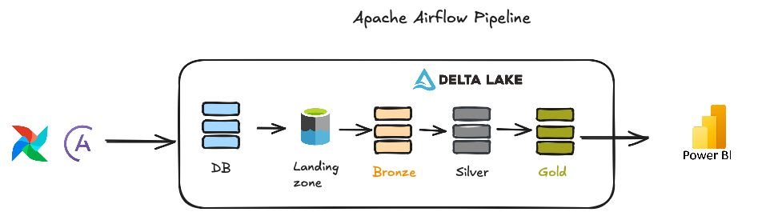
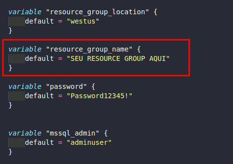

# 🚀 ETL Project with Apache Spark & Azure Data Lake

<div align="center">


**Modern ETL Pipeline for Large-Scale Data Processing**

[📖 Complete Documentation](https://arturoburigo.github.io/projeto_etl_spark/) • [🚀 Quick Start](#-quick-start) • [🏗️ Architecture](#️-architecture)

</div>

---

## 📋 Table of Contents

- [📖 About the Project](#-about-the-project)
- [🎯 Objectives](#-objectives)
- [🏗️ Architecture](#️-architecture)
- [🚀 Running](#-quick-start)
- [🔧 Configuration](#-configuration)
- [📊 Data Pipeline](#-data-pipeline)
- [🤝 Contributing](#-contributing)
- [👥 Team](#-team)
- [📄 License](#-license)

---

## 📖 About the Project

This project implements a **modern and scalable ETL pipeline** that extracts data from a SQL Server database, processes and transforms the data using Apache Spark, and stores it in Azure Data Lake following the **Medallion (Bronze, Silver, Gold)** architecture. The entire process is orchestrated by Apache Airflow with Docker containerization.

### 🎯 Business Context

The project simulates a **logistics and transportation system**, with more than 200k registers of data accross multiple tables:
- 👥 Customers and drivers
- 🚛 Vehicles and fleets
- 📦 Deliveries and pickups
- 🛣️ Routes and journeys
- 🔧 Maintenance and fueling
- 🚨 Fines and violations

---

## 🎯 Objectives

- ✅ **Extract** data from SQL Server efficiently
- ✅ **Store** data in Azure Data Lake with organized layers
- ✅ **Process** data with Apache Spark using Delta Lake
- ✅ **Transform** data following best quality practices
- ✅ **Automate** the entire pipeline with Apache Airflow
- ✅ **Monitor** executions and performance
- ✅ **Implement** dimensional model for analytics

---

## 🏗️ Architecture



### 📊 Data Layers (Medallion)
- **🥉 Bronze**: Raw data in Delta format
- **🥈 Silver**: Clean and standardized data
- **🥇 Gold**: Dimensional model and KPIs


## 🚀 Running

### 📋 Prerequisites

Make sure you have installed:

- 🐍 [Python 3.10+](https://www.python.org/downloads/)
- 🐳 [Docker & Docker Compose](https://www.docker.com/)
- ☁️ [Azure CLI](https://learn.microsoft.com/pt-br/cli/azure/install-azure-cli)
- 📦 [Poetry](https://python-poetry.org/docs/#installation)

### Installation

1. **Clone the repository**
   ```bash
   git clone https://github.com/arturoburigo/projeto_etl_spark
   cd projeto_etl_spark
   ```

2. **Start the SQL Server with pre-built data**:
   ```bash
   docker run --platform linux/amd64 -e "ACCEPT_EULA=Y" -e "SA_PASSWORD=satc@2025" -p 1433:1433 --name etl-deliveries-db -d arturoburigo/mssql-etl-deliveries-db:latest
   ```

3. **Set up Azure resources**:
   - Create a Microsoft/Azure account with access to paid resources
   - In the [Azure Portal](https://portal.azure.com/), create a workspace following the [Microsoft documentation](https://learn.microsoft.com/en-us/azure/databricks/getting-started/)
   - During this process, you will create a **resource group**. Save the resource group name as it will be used in the next step

   - **Configure Azure**:
   ```bash
   az login
   # Configure your credentials in the .env file
   ```

4. **Configure Terraform**:
   - In the file [`/iac/variables.tf`](https://github.com/arturoburigo/projeto_etl_spark/blob/iac/variables.tf), modify the following variable by adding the **resource group** you created previously:

   

5. **Deploy the cloud environment**:
   ```bash
   cd iac
   terraform init
   terraform apply
   ```

6. **Verify Azure resources**:
   - Check the [Azure Portal](https://portal.azure.com/) for the **MS SQL Server**, **MS SQL Database**, and **ADLS Gen2** containing the containers `landing-zone`, `bronze`, `silver`, and `gold` that were created in the previous step

7. **Generate SAS Token**:
   - In the [Azure Portal](https://portal.azure.com/), generate a **SAS TOKEN** for the `landing-zone` container following this [documentation](https://learn.microsoft.com/en-us/azure/ai-services/translator/document-translation/how-to-guides/create-sas-tokens?tabs=Containers#create-sas-tokens-in-the-azure-portal)
   - Save this token securely as it will be used in the next step

8. **Create environment files**:
   - Create a `.env` file in the `astro` folder

9. **Configure environment variables**:
   - Fill in the variables in both `.env` files with your Azure credentials and SAS token

10. **Set up Python environment**:
    ```bash
    poetry env activate
    poetry install
    ```

2. **Start Airflow**:
   ```bash
   cd astro
   astro dev start
   ```

4. **Execute the pipeline**:
   - Navigate to the DAG `Medallion Architecture - ETL"`
   - Click "Trigger DAG"

## 🔧 Configuration

### 🔐 Environment Variables

Create a `.env` file based on `.env.example`:

```bash
# Azure Data Lake
ADLS_ACCOUNT_NAME=your_storage_account
ADLS_FILE_SYSTEM_NAME=landing
ADLS_BRONZE_CONTAINER_NAME=bronze
ADLS_SILVER_CONTAINER_NAME=silver
ADLS_GOLD_CONTAINER_NAME=gold
ADLS_SAS_TOKEN=your_sas_token

# SQL Server
SQL_SERVER=your_server.database.windows.net
SQL_DATABASE=your_database
SQL_SCHEMA=dbo
SQL_USERNAME=your_username
SQL_PASSWORD=your_password

# Spark Configuration
SPARK_DRIVER_MEMORY=4g
SPARK_EXECUTOR_MEMORY=4g
SPARK_EXECUTOR_CORES=2
```


## 📊 Data Pipeline

### 🔄 Execution Flow

1. **🔍 Landing Zone**: Extract data from SQL Server to CSV
2. **🥉 Bronze Layer**: Ingest CSVs in Delta format
3. **🥈 Silver Layer**: Clean, standardize, and ensure data quality
4. **🥇 Gold Layer**: Create dimensional model and calculate KPIs


## 🤝 Contributing

Contributions are always welcome! Follow these steps:

1. **Fork** the project
2. **Create** a branch for your feature (`git checkout -b feature/AmazingFeature`)
3. **Commit** your changes (`git commit -m 'Add some AmazingFeature'`)
4. **Push** to the branch (`git push origin feature/AmazingFeature`)
5. **Open** a Pull Request

---

## 👥 Team

<table>
<tr>
<td align="center">
<a href="https://github.com/arturoburigo">
<br />
<sub><b>Arturo Burigo</b></sub>
</a><br />
<sub>Airflow | Terraform | ETL</sub>
</td>
<td align="center">
<a href="https://github.com/bezerraluiz">
<br />
<sub><b>Luiz Bezerra</b></sub>
</a><br />
<sub>Bronze | Gold | BI</sub>
</td>
<td align="center">
<a href="https://github.com/M0rona">
<br />
<sub><b>Gabriel Morona</b></sub>
</a><br />
<sub>Silver | BI </sub>
</td>
<td align="center">
<a href="https://github.com/laura27241">
<br />
<sub><b>Maria Laura</b></sub>
</a><br />
<sub>Gold | Docs</sub>
</td>
<td align="center">
<a href="https://github.com/amandadimas">
<br />
<sub><b>Amanda Dimas</b></sub>
</a><br />
<sub>Gold | SQL | Docs</sub>
</td>
</tr>
</table>

---

## 📄 License

This project is licensed under the **MIT License** - see the [LICENSE](LICENSE) file for details.

---


