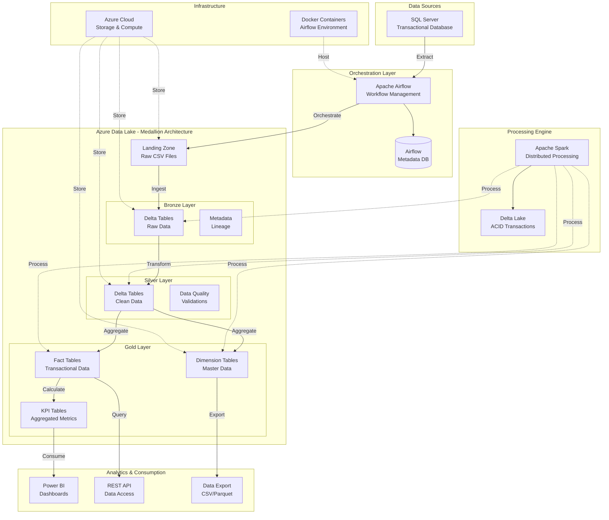
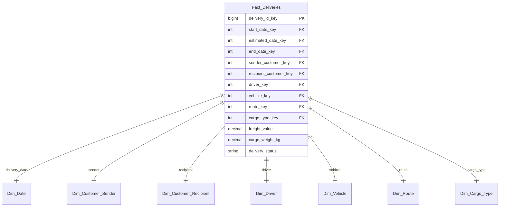

# 🏗️ System Architecture

## 📋 Overview

The project implements a **modern data architecture** based on the **Medallion Architecture** methodology (Bronze, Silver, Gold), using best practices for large-scale data processing. The solution is **cloud-native**, **scalable**, and **resilient**.

---

## 🎯 Architectural Principles

### 🔧 **Separation of Concerns**
Each layer has well-defined responsibilities, facilitating maintenance and evolution.

### ⚡ **Scalability First**
Architecture prepared for horizontal and vertical growth according to demand.

### 🛡️ **Fault Tolerance**
Retry mechanisms, checkpointing, and automatic recovery.

### 📊 **Data Quality**
Validations and transformations in each layer to ensure data quality.

### 🔒 **Security by Design**
Encryption, access control, and auditing in all components.

---

## 🏛️ General Architecture



---

## 📊 Medallion Architecture

### 🔍 **Landing Zone**
**Purpose**: Initial staging of raw extracted data

- **Format**: CSV files
- **Retention**: 30 days
- **Partitioning**: By extraction date
- **Schema**: Schema-on-read

```
landing/
├── customers_20241201_143022.csv
├── drivers_20241201_143025.csv
├── vehicles_20241201_143028.csv
└── deliveries_20241201_143030.csv
```

### 🥉 **Bronze Layer (Raw Data)**
**Purpose**: Complete and immutable historical storage

- **Format**: Delta Lake tables
- **Schema**: Preserves original structure + metadata
- **Partitioning**: By year/month/day
- **Retention**: Unlimited (historical data)

**Features:**
- ✅ ACID transactions via Delta Lake
- ✅ Time travel and versioning
- ✅ Ingestion metadata
- ✅ Automatic compaction

```python
# Bronze Structure
bronze_schema = {
    "original_columns": "preserved_as_extracted",
    "processing_date": "processing_date",
    "processing_timestamp": "processing_timestamp", 
    "source_file_name": "source_file_name",
    "_bronze_ingestion_id": "unique_ingestion_id"
}
```

### 🥈 **Silver Layer (Clean Data)**
**Purpose**: Clean, standardized, and enriched data

- **Format**: Delta Lake tables
- **Schema**: Standardized and normalized
- **Quality**: Applied validations and cleansing
- **Partitioning**: By business date

**Applied Transformations:**
- 🧹 **Data Cleansing**: Duplicate removal, null values
- 📏 **Standardization**: Format and type standardization
- 🔤 **Normalization**: Uppercase conversion, trim
- ✅ **Validation**: Business rules and quality
- 🏷️ **Enrichment**: Silver metadata addition

```python
# Example of Silver transformations
def silver_transformations(df):
    return df \
        .dropDuplicates() \
        .withColumn("customer_name", upper(trim(col("customer_name")))) \
        .withColumn("cpf_cnpj", regexp_replace(col("cpf_cnpj"), "[^0-9]", "")) \
        .withColumn("_silver_ingestion_timestamp", current_timestamp()) \
        .withColumn("_source_table", lit(table_name))
```

### 🥇 **Gold Layer (Business Data)**
**Purpose**: Dimensional model for analytics and BI

- **Format**: Delta Lake tables
- **Schema**: Star schema / Snowflake
- **Optimization**: Indexes and partitioning for queries
- **Aggregations**: Pre-calculated KPIs and metrics

**Dimensional Structure:**



---

## ⚙️ Technical Components

### 🎛️ **Apache Airflow**
**Responsibility**: Orchestration and scheduling

```python
# Optimized configuration
AIRFLOW_CONFIG = {
    "executor": "LocalExecutor",
    "max_active_runs": 1,
    "max_active_tasks": 4,
    "catchup": False,
    "depends_on_past": False,
    "retries": 3,
    "retry_delay": timedelta(minutes=5)
}
```

**Main DAG:**
```python
@dag(
    dag_id="medallion_architecture_etl",
    schedule="0 2 * * *",  # Daily at 2 AM
    start_date=datetime(2024, 1, 1),
    catchup=False,
    tags=["etl", "production"]
)
def etl_pipeline():
    extract_task = extract_from_sqlserver()
    bronze_task = process_bronze_layer()
    silver_task = process_silver_layer()
    gold_task = process_gold_layer()
    
    extract_task >> bronze_task >> silver_task >> gold_task
```

### ⚡ **Apache Spark**
**Responsibility**: Distributed data processing

**Optimized Configurations:**
```python
spark_config = {
    # Core Settings
    "spark.app.name": "etl_project_spark",
    "spark.sql.adaptive.enabled": "true",
    "spark.sql.adaptive.coalescePartitions.enabled": "true",
    
    # Delta Lake
    "spark.sql.extensions": "io.delta.sql.DeltaSparkSessionExtension",
    "spark.sql.catalog.spark_catalog": "org.apache.spark.sql.delta.catalog.DeltaCatalog",
    
    # Memory Management
    "spark.driver.memory": "4g",
    "spark.executor.memory": "4g",
    "spark.driver.maxResultSize": "2g",
    
    # Performance
    "spark.serializer": "org.apache.spark.serializer.KryoSerializer",
    "spark.sql.adaptive.skewJoin.enabled": "true",
    
    # Azure Integration
    "spark.hadoop.fs.azure.account.auth.type": "SAS",
    "spark.hadoop.fs.azure.sas.token.provider.type": "org.apache.hadoop.fs.azurebfs.sas.FixedSASTokenProvider"
}
```

### 🔺 **Delta Lake**
**Responsibility**: ACID transactions and versioning

**Benefits:**
- ✅ **ACID Transactions**: Consistency in concurrent operations
- ✅ **Time Travel**: Access to historical versions
- ✅ **Schema Evolution**: Schema changes without breaking compatibility
- ✅ **Merge Operations**: Efficient upserts
- ✅ **Automatic Compaction**: Automatic file optimization

```python
# Example of merge operation
delta_table = DeltaTable.forPath(spark, gold_path)
delta_table.alias("target") \
    .merge(updates_df.alias("source"), "target.id = source.id") \
    .whenMatchedUpdateAll() \
    .whenNotMatchedInsertAll() \
    .execute()
```

---

## ☁️ Azure Infrastructure

### 🗄️ **Azure Data Lake Storage Gen2**
**Configuration:**
- **Replication**: LRS (Locally Redundant Storage)
- **Access Tier**: Hot (frequently accessed data)
- **Hierarchical Namespace**: Enabled
- **Security**: SAS tokens with granular permissions

**Container Structure:**
```
adlsaccount/
├── landing/          # Raw CSV files
├── bronze/           # Delta tables - raw data
├── silver/           # Delta tables - clean data
├── gold/             # Delta tables - dimensional model
└── checkpoints/      # Spark checkpoints
```

### 🔐 **Security**
- **Authentication**: SAS Tokens with expiration
- **Authorization**: RBAC in Azure AD
- **Encryption**: At rest and in transit
- **Network**: Private endpoints (when necessary)

---

## 🔄 Detailed Data Flow

### 1. **Extraction (SQL Server → Landing Zone)**
```python
def extract_from_sqlserver():
    # Optimized connection with connection pool
    engine = create_engine(
        connection_string,
        pool_size=10,
        pool_recycle=3600,
        pool_pre_ping=True
    )
    
    # Incremental extraction based on timestamp
    query = f"""
    SELECT * FROM {schema}.{table} 
    WHERE last_modified >= '{last_extraction_time}'
    """
    
    df = pd.read_sql(query, engine)
    
    # Upload to ADLS with timestamp
    filename = f"{table}_{datetime.now().strftime('%Y%m%d_%H%M%S')}.csv"
    upload_to_adls(df, filename)
```

### 2. **Bronze Processing (Landing → Bronze)**
```python
def process_bronze_layer():
    # Read CSVs with schema inference
    df = spark.read \
        .option("header", "true") \
        .option("inferSchema", "true") \
        .csv(landing_path)
    
    # Add metadata
    df_bronze = df \
        .withColumn("processing_date", current_date()) \
        .withColumn("processing_timestamp", current_timestamp()) \
        .withColumn("source_file_name", input_file_name())
    
    # Write in Delta format
    df_bronze.write \
        .format("delta") \
        .mode("append") \
        .option("mergeSchema", "true") \
        .save(bronze_path)
```

### 3. **Silver Processing (Bronze → Silver)**
```python
def process_silver_layer():
    # Read from Bronze layer
    df_bronze = spark.read.format("delta").load(bronze_path)
    
    # Apply quality transformations
    df_silver = df_bronze \
        .dropDuplicates() \
        .filter(col("id").isNotNull()) \
        .withColumn("name", upper(trim(col("name")))) \
        .withColumn("cpf", regexp_replace(col("cpf"), "[^0-9]", ""))
    
    # Business validations
    df_validated = apply_business_rules(df_silver)
    
    # Write with partitioning
    df_validated.write \
        .format("delta") \
        .mode("overwrite") \
        .partitionBy("year", "month") \
        .save(silver_path)
```

### 4. **Gold Processing (Silver → Gold)**
```python
def process_gold_layer():
    # Create dimensions
    create_dimensions()
    
    # Create fact tables
    create_fact_tables()
    
    # Calculate KPIs
    calculate_kpis()
```

---

## 📊 Partitioning Strategy

### **Bronze Layer**
```
bronze/
└── customers/
    └── year=2024/
        └── month=12/
            └── day=01/
                ├── part-00000.parquet
                └── _delta_log/
```

### **Silver Layer**
```
silver/
└── customers/
    └── year=2024/
        └── month=12/
            ├── part-00000.parquet
            └── _delta_log/
```

### **Gold Layer**
```
gold/
├── dim_customer/
│   └── part-00000.parquet
├── dim_date/
│   └── part-00000.parquet
└── fact_deliveries/
    └── delivery_date=2024-12-01/
        └── part-00000.parquet
```

---

## 🔍 Monitoring and Observability

### **Collected Metrics**
- ⏱️ **Performance**: Execution time per task
- 📊 **Volume**: Number of records processed
- 💾 **Storage**: Data size per layer
- ❌ **Errors**: Failure rate and error types
- 🔄 **Throughput**: Records processed per second

### **Configured Alerts**
- 🚨 **DAG execution failure**
- ⏰ **SLA breach** (execution > 2 hours)
- 📈 **Anomalous data volume**
- 💾 **Low disk space**

### **Dashboards**
- 📊 **Airflow UI**: Execution status
- 📈 **Spark UI**: Job performance
- ☁️ **Azure Monitor**: Infrastructure metrics

---

## 🔄 Backup and Recovery Strategy

### **Backup**
- 📅 **Daily**: Automatic snapshot of Gold tables
- 📅 **Weekly**: Complete backup of Silver and Bronze layers
- 📅 **Monthly**: Archive to long-term storage

### **Recovery**
- 🔄 **Time Travel**: Delta Lake allows point-in-time recovery
- 📋 **Replay**: Re-execution of DAGs from any date
- 🔄 **Rollback**: Reversion to previous version in case of issues

---

## 🚀 Scalability

### **Horizontal Scaling**
- **Spark**: Increase number of executors
- **Airflow**: Multiple workers
- **Azure**: Auto-scaling based on demand

### **Vertical Scaling**
- **Memory**: Increase memory per executor
- **CPU**: More cores per machine
- **Storage**: Upgrade to premium SSDs

### **Optimizations**
- **Caching**: Frequently accessed data
- **Indexing**: Z-Order indexes in Delta Lake
- **Compaction**: Automatic optimization of small files

---

This architecture ensures **high availability**, **scalability**, and **maintainability**, following industry best practices for modern data pipelines.