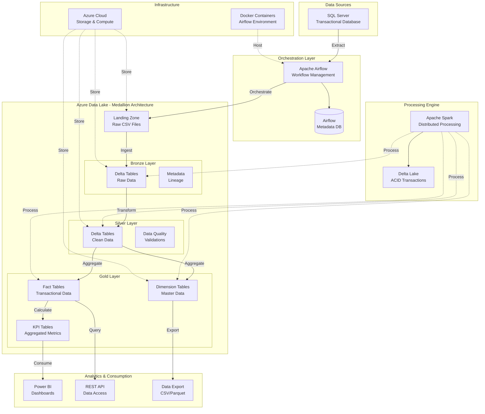
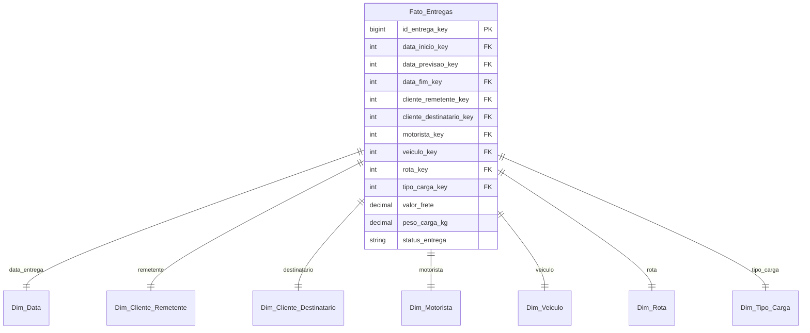

# 🏗️ Arquitetura do Sistema

## 📋 Visão Geral

O projeto implementa uma **arquitetura moderna de dados** baseada na metodologia **Medallion Architecture** (Bronze, Silver, Gold), utilizando as melhores práticas para processamento de dados em larga escala. A solução é **cloud-native**, **escalável** e **resiliente**.

---

## 🎯 Princípios Arquiteturais

### 🔧 **Separation of Concerns**
Cada camada tem responsabilidades bem definidas, facilitando manutenção e evolução.

### ⚡ **Scalability First**
Arquitetura preparada para crescimento horizontal e vertical conforme demanda.

### 🛡️ **Fault Tolerance**
Mecanismos de retry, checkpointing e recuperação automática.

### 📊 **Data Quality**
Validações e transformações em cada camada para garantir qualidade dos dados.

### 🔒 **Security by Design**
Criptografia, controle de acesso e auditoria em todos os componentes.

---

## 🏛️ Arquitetura Geral



---

## 📊 Arquitetura Medallion

### 🔍 **Landing Zone**
**Finalidade**: Staging inicial dos dados brutos extraídos

- **Formato**: CSV files
- **Retenção**: 30 dias
- **Particionamento**: Por data de extração
- **Schema**: Schema-on-read

```
landing/
├── clientes_20241201_143022.csv
├── motoristas_20241201_143025.csv
├── veiculos_20241201_143028.csv
└── entregas_20241201_143030.csv
```

### 🥉 **Bronze Layer (Raw Data)**
**Finalidade**: Armazenamento histórico completo e imutável

- **Formato**: Delta Lake tables
- **Schema**: Preserva estrutura original + metadados
- **Particionamento**: Por ano/mês/dia
- **Retenção**: Ilimitada (dados históricos)

**Características:**
- ✅ ACID transactions via Delta Lake
- ✅ Time travel e versionamento
- ✅ Metadados de ingestão
- ✅ Compactação automática

```python
# Estrutura Bronze
bronze_schema = {
    "original_columns": "preservadas_como_extraídas",
    "processing_date": "data_do_processamento",
    "processing_timestamp": "timestamp_do_processamento", 
    "source_file_name": "nome_do_arquivo_origem",
    "_bronze_ingestion_id": "id_único_da_ingestão"
}
```

### 🥈 **Silver Layer (Clean Data)**
**Finalidade**: Dados limpos, padronizados e enriquecidos

- **Formato**: Delta Lake tables
- **Schema**: Padronizado e normalizado
- **Qualidade**: Validações e limpezas aplicadas
- **Particionamento**: Por data de negócio

**Transformações Aplicadas:**
- 🧹 **Data Cleansing**: Remoção de duplicatas, valores nulos
- 📏 **Standardization**: Padronização de formatos e tipos
- 🔤 **Normalization**: Conversão para maiúsculas, trim
- ✅ **Validation**: Regras de negócio e qualidade
- 🏷️ **Enrichment**: Adição de metadados Silver

```python
# Exemplo de transformações Silver
def silver_transformations(df):
    return df \
        .dropDuplicates() \
        .withColumn("nome_cliente", upper(trim(col("nome_cliente")))) \
        .withColumn("cpf_cnpj", regexp_replace(col("cpf_cnpj"), "[^0-9]", "")) \
        .withColumn("_silver_ingestion_timestamp", current_timestamp()) \
        .withColumn("_source_table", lit(table_name))
```

### 🥇 **Gold Layer (Business Data)**
**Finalidade**: Modelo dimensional para analytics e BI

- **Formato**: Delta Lake tables
- **Schema**: Star schema / Snowflake
- **Otimização**: Índices e particionamento para queries
- **Agregações**: KPIs e métricas pré-calculadas

**Estrutura Dimensional:**



---

## ⚙️ Componentes Técnicos

### 🎛️ **Apache Airflow**
**Responsabilidade**: Orquestração e agendamento

```python
# Configuração otimizada
AIRFLOW_CONFIG = {
    "executor": "LocalExecutor",
    "max_active_runs": 1,
    "max_active_tasks": 4,
    "catchup": False,
    "depends_on_past": False,
    "retries": 3,
    "retry_delay": timedelta(minutes=5)
}
```

**DAG Principal:**
```python
@dag(
    dag_id="sqlserver_to_bronze_adls",
    schedule="0 2 * * *",  # Daily at 2 AM
    start_date=datetime(2024, 1, 1),
    catchup=False,
    tags=["etl", "production"]
)
def etl_pipeline():
    extract_task = extract_from_sqlserver()
    bronze_task = process_bronze_layer()
    silver_task = process_silver_layer()
    gold_task = process_gold_layer()
    
    extract_task >> bronze_task >> silver_task >> gold_task
```

### ⚡ **Apache Spark**
**Responsabilidade**: Processamento distribuído de dados

**Configurações Otimizadas:**
```python
spark_config = {
    # Core Settings
    "spark.app.name": "projeto_etl_spark",
    "spark.sql.adaptive.enabled": "true",
    "spark.sql.adaptive.coalescePartitions.enabled": "true",
    
    # Delta Lake
    "spark.sql.extensions": "io.delta.sql.DeltaSparkSessionExtension",
    "spark.sql.catalog.spark_catalog": "org.apache.spark.sql.delta.catalog.DeltaCatalog",
    
    # Memory Management
    "spark.driver.memory": "4g",
    "spark.executor.memory": "4g",
    "spark.driver.maxResultSize": "2g",
    
    # Performance
    "spark.serializer": "org.apache.spark.serializer.KryoSerializer",
    "spark.sql.adaptive.skewJoin.enabled": "true",
    
    # Azure Integration
    "spark.hadoop.fs.azure.account.auth.type": "SAS",
    "spark.hadoop.fs.azure.sas.token.provider.type": "org.apache.hadoop.fs.azurebfs.sas.FixedSASTokenProvider"
}
```

### 🔺 **Delta Lake**
**Responsabilidade**: ACID transactions e versionamento

**Benefícios:**
- ✅ **ACID Transactions**: Consistência em operações concorrentes
- ✅ **Time Travel**: Acesso a versões históricas
- ✅ **Schema Evolution**: Mudanças de schema sem quebrar compatibilidade
- ✅ **Merge Operations**: Upserts eficientes
- ✅ **Automatic Compaction**: Otimização automática de arquivos

```python
# Exemplo de merge operation
delta_table = DeltaTable.forPath(spark, gold_path)
delta_table.alias("target") \
    .merge(updates_df.alias("source"), "target.id = source.id") \
    .whenMatchedUpdateAll() \
    .whenNotMatchedInsertAll() \
    .execute()
```

---

## ☁️ Infraestrutura Azure

### 🗄️ **Azure Data Lake Storage Gen2**
**Configuração:**
- **Replication**: LRS (Locally Redundant Storage)
- **Access Tier**: Hot (dados frequentemente acessados)
- **Hierarchical Namespace**: Habilitado
- **Security**: SAS tokens com permissões granulares

**Estrutura de Containers:**
```
adlsaccount/
├── landing/          # Raw CSV files
├── bronze/           # Delta tables - raw data
├── silver/           # Delta tables - clean data
├── gold/             # Delta tables - dimensional model
└── checkpoints/      # Spark checkpoints
```

### 🔐 **Segurança**
- **Authentication**: SAS Tokens com expiração
- **Authorization**: RBAC no Azure AD
- **Encryption**: At rest e in transit
- **Network**: Private endpoints (quando necessário)

---

## 🔄 Fluxo de Dados Detalhado

### 1. **Extração (SQL Server → Landing Zone)**
```python
def extract_from_sqlserver():
    # Conexão otimizada com pool de conexões
    engine = create_engine(
        connection_string,
        pool_size=10,
        pool_recycle=3600,
        pool_pre_ping=True
    )
    
    # Extração incremental baseada em timestamp
    query = f"""
    SELECT * FROM {schema}.{table} 
    WHERE last_modified >= '{last_extraction_time}'
    """
    
    df = pd.read_sql(query, engine)
    
    # Upload para ADLS com timestamp
    filename = f"{table}_{datetime.now().strftime('%Y%m%d_%H%M%S')}.csv"
    upload_to_adls(df, filename)
```

### 2. **Processamento Bronze (Landing → Bronze)**
```python
def process_bronze_layer():
    # Leitura dos CSVs com schema inference
    df = spark.read \
        .option("header", "true") \
        .option("inferSchema", "true") \
        .csv(landing_path)
    
    # Adição de metadados
    df_bronze = df \
        .withColumn("processing_date", current_date()) \
        .withColumn("processing_timestamp", current_timestamp()) \
        .withColumn("source_file_name", input_file_name())
    
    # Escrita em Delta format
    df_bronze.write \
        .format("delta") \
        .mode("append") \
        .option("mergeSchema", "true") \
        .save(bronze_path)
```

### 3. **Processamento Silver (Bronze → Silver)**
```python
def process_silver_layer():
    # Leitura da camada Bronze
    df_bronze = spark.read.format("delta").load(bronze_path)
    
    # Aplicação de transformações de qualidade
    df_silver = df_bronze \
        .dropDuplicates() \
        .filter(col("id").isNotNull()) \
        .withColumn("nome", upper(trim(col("nome")))) \
        .withColumn("cpf", regexp_replace(col("cpf"), "[^0-9]", ""))
    
    # Validações de negócio
    df_validated = apply_business_rules(df_silver)
    
    # Escrita com particionamento
    df_validated.write \
        .format("delta") \
        .mode("overwrite") \
        .partitionBy("ano", "mes") \
        .save(silver_path)
```

### 4. **Processamento Gold (Silver → Gold)**
```python
def process_gold_layer():
    # Criação das dimensões
    create_dimensions()
    
    # Criação das tabelas fato
    create_fact_tables()
    
    # Cálculo de KPIs
    calculate_kpis()
```

---

## 📊 Estratégia de Particionamento

### **Bronze Layer**
```
bronze/
└── clientes/
    └── year=2024/
        └── month=12/
            └── day=01/
                ├── part-00000.parquet
                └── _delta_log/
```

### **Silver Layer**
```
silver/
└── clientes/
    └── ano=2024/
        └── mes=12/
            ├── part-00000.parquet
            └── _delta_log/
```

### **Gold Layer**
```
gold/
├── dim_cliente/
│   └── part-00000.parquet
├── dim_data/
│   └── part-00000.parquet
└── fato_entregas/
    └── data_entrega=2024-12-01/
        └── part-00000.parquet
```

---

## 🔍 Monitoramento e Observabilidade

### **Métricas Coletadas**
- ⏱️ **Performance**: Tempo de execução por task
- 📊 **Volume**: Quantidade de registros processados
- 💾 **Storage**: Tamanho dos dados por camada
- ❌ **Errors**: Taxa de falhas e tipos de erro
- 🔄 **Throughput**: Registros processados por segundo

### **Alertas Configurados**
- 🚨 **Falha de execução** de DAGs
- ⏰ **SLA breach** (execução > 2 horas)
- 📈 **Volume anômalo** de dados
- 💾 **Espaço em disco** baixo

### **Dashboards**
- 📊 **Airflow UI**: Status das execuções
- 📈 **Spark UI**: Performance das jobs
- ☁️ **Azure Monitor**: Métricas de infraestrutura

---

## 🔄 Estratégia de Backup e Recovery

### **Backup**
- 📅 **Daily**: Snapshot automático das tabelas Gold
- 📅 **Weekly**: Backup completo das camadas Silver e Bronze
- 📅 **Monthly**: Archive para storage de longo prazo

### **Recovery**
- 🔄 **Time Travel**: Delta Lake permite recuperação point-in-time
- 📋 **Replay**: Re-execução de DAGs a partir de qualquer data
- 🔄 **Rollback**: Reversão para versão anterior em caso de problemas

---

## 🚀 Escalabilidade

### **Horizontal Scaling**
- **Spark**: Aumento do número de executors
- **Airflow**: Múltiplos workers
- **Azure**: Auto-scaling baseado em demanda

### **Vertical Scaling**
- **Memory**: Aumento da memória por executor
- **CPU**: Mais cores por máquina
- **Storage**: Upgrade para SSDs premium

### **Otimizações**
- **Caching**: Dados frequentemente acessados
- **Indexing**: Índices Z-Order no Delta Lake
- **Compaction**: Otimização automática de arquivos pequenos

---

Esta arquitetura garante **alta disponibilidade**, **escalabilidade** e **manutenibilidade**, seguindo as melhores práticas da indústria para pipelines de dados modernos. 