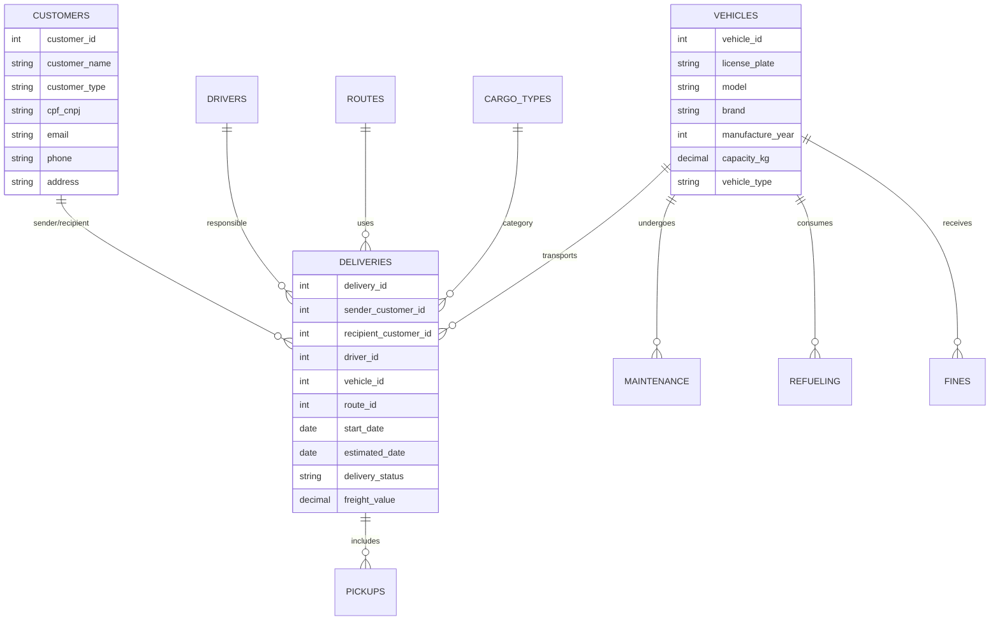
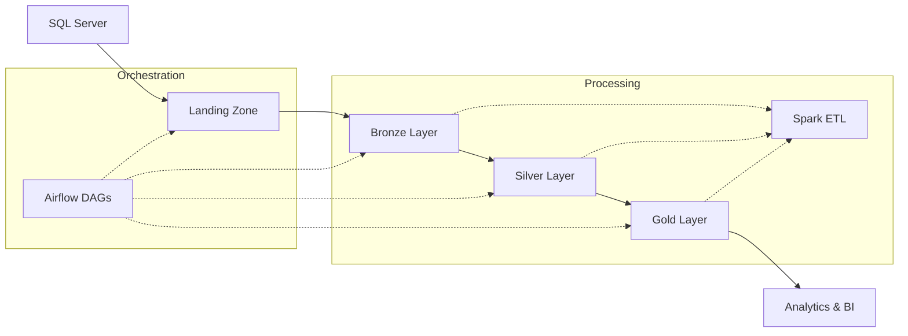

# 🚀 ETL Project with Apache Spark & Azure Data Lake

<div class="grid cards" markdown>

-   :material-rocket-launch:{ .lg .middle } **Modern ETL Pipeline**

    ---

    Scalable pipeline for large-scale data processing using Apache Spark, orchestrated by Apache Airflow and stored in Azure Data Lake.

    [:octicons-arrow-right-24: Quick Start](quick_start.md)

-   :material-cloud:{ .lg .middle } **Medallion Architecture**

    ---

    Implementation of Medallion architecture (Bronze, Silver, Gold) for enterprise-grade data organization and processing.

    [:octicons-arrow-right-24: View Architecture](architecture.md)

-   :material-chart-line:{ .lg .middle } **Analytics & KPIs**

    ---

    Dimensional model with business KPIs for logistics performance analysis and operational metrics.

    [:octicons-arrow-right-24: View KPIs](kpis_metrics.md)

-   :material-cog:{ .lg .middle } **Advanced Orchestration**

    ---

    Parameterizable DAGs in Airflow with monitoring, automatic retry, and status notifications.

    [:octicons-arrow-right-24: View Airflow](airflow.md)

</div>

---

## 🎯 About the Project

This project implements a **complete and modern ETL pipeline** that demonstrates best practices for large-scale data processing. The system processes data from a **logistics and transportation context**, including information about customers, drivers, vehicles, deliveries, routes, and maintenance.

### ✨ Key Features

- **🔄 Complete ETL**: Extraction from SQL Server, transformation with Spark, loading into Data Lake
- **🏗️ Medallion Architecture**: Organization in Bronze, Silver, and Gold layers
- **⚡ Distributed Processing**: Apache Spark with Delta Lake for ACID transactions
- **🎛️ Orchestration**: Apache Airflow for automation and monitoring
- **☁️ Cloud Native**: Complete integration with Azure Data Lake Storage
- **📊 Analytics Ready**: Dimensional model for Business Intelligence

---

## 🛠️ Technology Stack

<div class="grid cards" markdown>

-   :material-language-python:{ .lg .middle } **Python 3.10+**
    
    ---
    
    Main language for pipeline development, with specialized data processing libraries.

-   :simple-apachespark:{ .lg .middle } **Apache Spark 3.x**
    
    ---
    
    Distributed processing engine for large-scale data transformations with Delta Lake.

-   :simple-apacheairflow:{ .lg .middle } **Apache Airflow 2.x**
    
    ---
    
    Orchestration platform for pipeline automation, scheduling, and monitoring.

-   :simple-microsoftazure:{ .lg .middle } **Azure Data Lake**
    
    ---
    
    Scalable and secure storage for structured and semi-structured data.

-   :simple-docker:{ .lg .middle } **Docker & Compose**
    
    ---
    
    Containerization for consistent environment and simplified deployment.

-   :simple-terraform:{ .lg .middle } **Terraform**
    
    ---
    
    Infrastructure as Code for automated Azure resource provisioning.

</div>

---

## 📊 Data Model

The project processes data from a **logistics and transportation system** with the following main entities:



---

## 🚀 Quick Start

### 1. **Prerequisites**

Make sure you have installed:

- [x] Python 3.10+
- [x] Docker & Docker Compose
- [x] Azure CLI
- [x] Poetry (dependency manager)

### 2. **Installation**

```bash
# Clone the repository
git clone https://github.com/arturoburigo/projeto_etl_spark
cd projeto_etl_spark

# Install dependencies
poetry install

# Configure environment variables
cp .env.example .env
# Edit the .env file with your Azure credentials
```

### 3. **Execution**

```bash
# Start Airflow
cd astro
astro dev start

# Access the web interface
# http://localhost:8080 (admin/admin)
```

### 4. **Run the Pipeline**

1. Navigate to the DAG `Medallion Architecture - ETL`
2. Click "Trigger DAG"
3. Monitor execution in the Airflow interface

!!! tip "Tip"
    For more detailed configuration, see the complete [Installation Guide](installation.md).

---

## 📈 Data Pipeline

### 🔄 Execution Flow



### 📊 Data Layers

| Layer | Description | Format | Purpose |
|-------|-------------|--------|---------|
| **🔍 Landing** | Raw extracted data | CSV | Initial staging |
| **🥉 Bronze** | Complete historical data | Delta | Data Lake |
| **🥈 Silver** | Clean and standardized data | Delta | Analytics |
| **🥇 Gold** | Dimensional model | Delta | Business Intelligence |

---

## 🎯 KPIs and Metrics

The project automatically calculates the following performance indicators:

<div class="grid cards" markdown>

-   :material-truck-delivery:{ .lg .middle } **On-Time Delivery**

    ---

    Percentage of deliveries completed within the established deadline.
    
    **Target**: > 95%

-   :material-map-marker-path:{ .lg .middle } **Cost per Route**

    ---

    Average freight cost per kilometer on each route.
    
    **Analysis**: Weekly

-   :material-truck:{ .lg .middle } **Fleet Utilization**

    ---

    Total deliveries by vehicle type and occupancy rate.
    
    **Frequency**: Monthly

-   :material-account-cash:{ .lg .middle } **Revenue per Customer**

    ---

    Total freight value generated by each customer.
    
    **Segmentation**: By region

</div>

---

## 📚 Next Steps

<div class="grid cards" markdown>

-   :material-book-open-page-variant:{ .lg .middle } **[📖 Complete Documentation](installation.md)**

    ---

    Detailed guides for installation, configuration, and system usage.

-   :material-architecture:{ .lg .middle } **[🏗️ Architecture](architecture.md)**

    ---

    Detailed view of system architecture and design decisions.

-   :material-pipe:{ .lg .middle } **[🔧 ETL Pipeline](etl_pipeline.md)**

    ---

    Technical documentation of data pipeline and transformations.

-   :material-test-tube:{ .lg .middle } **[🧪 Tests](tests.md)**

    ---

    Testing strategy, coverage, and how to run tests.

</div>

---

## 🤝 Contributing

Contributions are always welcome! This project follows collaborative development best practices:

- **Code Review**: All PRs go through review
- **Automated Tests**: Test coverage > 80%
- **Documentation**: All functionality must be documented
- **Standards**: We follow PEP 8 and use Black for formatting

[How to Contribute →](contributing.md){ .md-button .md-button--primary }

---

## 👥 Team

This project was developed by a multidisciplinary team of data specialists:

- **Arturo Burigo** - Tech Lead & Architecture
- **Luiz Bezerra** - Data Engineer
- **Gabriel Morona** - Spark Developer  
- **Maria Laura** - Data Analyst
- **Amanda Dimas** - QA Engineer

---

!!! info "License"
    This project is licensed under the **MIT License**. See the [LICENSE](https://github.com/arturoburigo/projeto_etl_spark/blob/main/LICENSE) file for details.