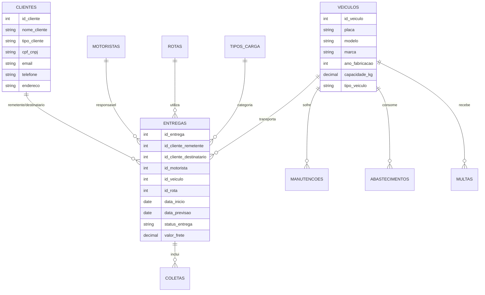
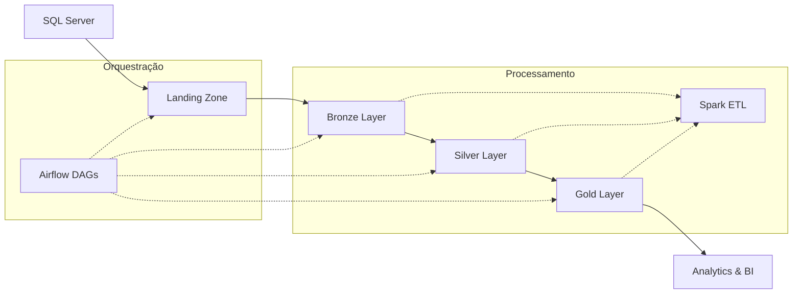

# 🚀 Projeto ETL com Apache Spark & Azure Data Lake

<div class="grid cards" markdown>

-   :material-rocket-launch:{ .lg .middle } **Pipeline ETL Moderno**

    ---

    Pipeline escalável para processamento de dados em larga escala usando Apache Spark, orquestrado por Apache Airflow e armazenado no Azure Data Lake.

    [:octicons-arrow-right-24: Início Rápido](inicio_rapido.md)

-   :material-cloud:{ .lg .middle } **Arquitetura Medallion**

    ---

    Implementação da arquitetura Medallion (Bronze, Silver, Gold) para organização e processamento de dados com qualidade empresarial.

    [:octicons-arrow-right-24: Ver Arquitetura](arquitetura.md)

-   :material-chart-line:{ .lg .middle } **Analytics & KPIs**

    ---

    Modelo dimensional com KPIs de negócio para análise de performance logística e métricas operacionais.

    [:octicons-arrow-right-24: Ver KPIs](kpis_metricas.md)

-   :material-cog:{ .lg .middle } **Orquestração Avançada**

    ---

    DAGs parametrizáveis no Airflow com monitoramento, retry automático e notificações de status.

    [:octicons-arrow-right-24: Ver Airflow](airflow.md)

</div>

---

## 🎯 Sobre o Projeto

Este projeto implementa um **pipeline ETL completo e moderno** que demonstra as melhores práticas para processamento de dados em larga escala. O sistema processa dados de um contexto de **logística e transporte**, incluindo informações sobre clientes, motoristas, veículos, entregas, rotas e manutenções.

### ✨ Principais Características

- **🔄 ETL Completo**: Extração do SQL Server, transformação com Spark, carregamento no Data Lake
- **🏗️ Arquitetura Medallion**: Organização em camadas Bronze, Silver e Gold
- **⚡ Processamento Distribuído**: Apache Spark com Delta Lake para ACID transactions
- **🎛️ Orquestração**: Apache Airflow para automação e monitoramento
- **☁️ Cloud Native**: Integração completa com Azure Data Lake Storage
- **📊 Analytics Ready**: Modelo dimensional para Business Intelligence

---

## 🛠️ Stack Tecnológico

<div class="grid cards" markdown>

-   :material-language-python:{ .lg .middle } **Python 3.10+**
    
    ---
    
    Linguagem principal para desenvolvimento do pipeline, com bibliotecas especializadas em processamento de dados.

-   :simple-apachespark:{ .lg .middle } **Apache Spark 3.x**
    
    ---
    
    Engine de processamento distribuído para transformações de dados em larga escala com Delta Lake.

-   :simple-apacheairflow:{ .lg .middle } **Apache Airflow 2.x**
    
    ---
    
    Plataforma de orquestração para automação, agendamento e monitoramento do pipeline.

-   :simple-microsoftazure:{ .lg .middle } **Azure Data Lake**
    
    ---
    
    Armazenamento escalável e seguro para dados estruturados e semi-estruturados.

-   :simple-docker:{ .lg .middle } **Docker & Compose**
    
    ---
    
    Containerização para ambiente consistente e deploy simplificado.

-   :simple-terraform:{ .lg .middle } **Terraform**
    
    ---
    
    Infrastructure as Code para provisionamento automatizado de recursos Azure.

</div>

---

## 📊 Modelo de Dados

O projeto processa dados de um sistema de **logística e transporte** com as seguintes entidades principais:



---

## 🚀 Início Rápido

### 1. **Pré-requisitos**

Certifique-se de ter instalado:

- [x] Python 3.10+
- [x] Docker & Docker Compose
- [x] Azure CLI
- [x] Poetry (gerenciador de dependências)

### 2. **Instalação**

```bash
# Clone o repositório
git clone https://github.com/seu-usuario/projeto_etl_spark.git
cd projeto_etl_spark

# Instale as dependências
poetry install

# Configure as variáveis de ambiente
cp .env.example .env
# Edite o arquivo .env com suas credenciais Azure
```

### 3. **Execução**

```bash
# Inicie o Airflow
cd astro
astro dev start

# Acesse a interface web
# http://localhost:8080 (admin/admin)
```

### 4. **Execute o Pipeline**

1. Navegue até a DAG `sqlserver_to_bronze_adls`
2. Clique em "Trigger DAG"
3. Monitore a execução na interface do Airflow

!!! tip "Dica"
    Para uma configuração mais detalhada, consulte o [Guia de Instalação](instalacao.md) completo.

---

## 📈 Pipeline de Dados

### 🔄 Fluxo de Execução



### 📊 Camadas de Dados

| Camada | Descrição | Formato | Finalidade |
|--------|-----------|---------|------------|
| **🔍 Landing** | Dados brutos extraídos | CSV | Staging inicial |
| **🥉 Bronze** | Dados históricos completos | Delta | Data Lake |
| **🥈 Silver** | Dados limpos e padronizados | Delta | Analytics |
| **🥇 Gold** | Modelo dimensional | Delta | Business Intelligence |

---

## 🎯 KPIs e Métricas

O projeto calcula automaticamente os seguintes indicadores de performance:

<div class="grid cards" markdown>

-   :material-truck-delivery:{ .lg .middle } **On-Time Delivery**

    ---

    Percentual de entregas realizadas dentro do prazo estabelecido.
    
    **Meta**: > 95%

-   :material-map-marker-path:{ .lg .middle } **Custo por Rota**

    ---

    Custo médio de frete por quilômetro em cada rota.
    
    **Análise**: Semanal

-   :material-truck:{ .lg .middle } **Utilização da Frota**

    ---

    Total de entregas por tipo de veículo e taxa de ocupação.
    
    **Frequência**: Mensal

-   :material-account-cash:{ .lg .middle } **Revenue por Cliente**

    ---

    Valor total de frete gerado por cada cliente.
    
    **Segmentação**: Por região

</div>

---

## 📚 Próximos Passos

<div class="grid cards" markdown>

-   :material-book-open-page-variant:{ .lg .middle } **[📖 Documentação Completa](instalacao.md)**

    ---

    Guias detalhados de instalação, configuração e uso do sistema.

-   :material-architecture:{ .lg .middle } **[🏗️ Arquitetura](arquitetura.md)**

    ---

    Visão detalhada da arquitetura do sistema e decisões de design.

-   :material-pipe:{ .lg .middle } **[🔧 Pipeline ETL](pipeline_etl.md)**

    ---

    Documentação técnica do pipeline de dados e transformações.

-   :material-test-tube:{ .lg .middle } **[🧪 Testes](testes.md)**

    ---

    Estratégia de testes, cobertura e como executar os testes.

</div>

---

## 🤝 Contribuição

Contribuições são sempre bem-vindas! Este projeto segue as melhores práticas de desenvolvimento colaborativo:

- **Code Review**: Todos os PRs passam por revisão
- **Testes Automatizados**: Cobertura de testes > 80%
- **Documentação**: Toda funcionalidade deve ser documentada
- **Padrões**: Seguimos PEP 8 e usamos Black para formatação

[Como Contribuir →](contribuicao.md){ .md-button .md-button--primary }

---

## 👥 Equipe

Este projeto foi desenvolvido por uma equipe multidisciplinar de especialistas em dados:

- **Arturo Burigo** - Tech Lead & Architecture
- **Luiz Bezerra** - Data Engineer
- **Gabriel Morona** - Spark Developer  
- **Maria Laura** - Data Analyst
- **Amanda Dimas** - QA Engineer

---

!!! info "Licença"
    Este projeto está licenciado sob a **MIT License**. Veja o arquivo [LICENSE](https://github.com/seu-usuario/projeto_etl_spark/blob/main/LICENSE) para detalhes.