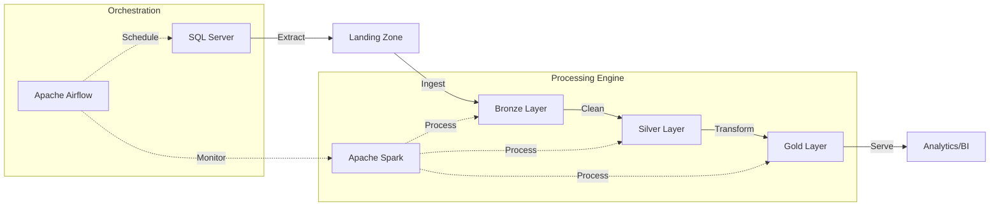

# ETL Pipeline

## Overview

The ETL pipeline implements a modern data processing architecture using the Medallion pattern (Bronze, Silver, Gold) to ensure data quality and enable analytics at scale.

## Pipeline Stages

### 1. **Extraction (SQL Server → Landing Zone)**
- Extracts data from transactional SQL Server database
- Supports both full and incremental extraction
- Outputs CSV files to Azure Data Lake landing zone
- Includes metadata for lineage tracking

### 2. **Bronze Layer (Landing → Bronze)**
- Ingests raw CSV files into Delta Lake format
- Preserves original data structure
- Adds processing metadata
- Enables time travel and data versioning

### 3. **Silver Layer (Bronze → Silver)**
- Applies data quality rules and validations
- Standardizes data formats and types
- Removes duplicates and handles null values
- Enriches data with business logic

### 4. **Gold Layer (Silver → Gold)**
- Creates dimensional model (star schema)
- Calculates business KPIs and metrics
- Optimizes for analytical queries
- Provides aggregated views for BI tools

## Data Flow Architecture



## Key Technologies

### **Apache Spark**
- Distributed processing engine
- Handles large-scale transformations
- Supports Delta Lake format
- Provides fault tolerance

### **Delta Lake**
- ACID transactions on data lake
- Schema enforcement and evolution
- Time travel capabilities
- Efficient merge operations

### **Azure Data Lake Storage**
- Scalable cloud storage
- Hierarchical namespace
- Security and compliance
- Cost-effective storage tiers

## Processing Patterns

### **Incremental Processing**
```python
def incremental_extract(last_run_date):
    query = f"""
    SELECT * FROM transactions 
    WHERE modified_date > '{last_run_date}'
    """
    return pd.read_sql(query, connection)
```

### **Data Quality Checks**
```python
def validate_data_quality(df):
    # Check for nulls in required fields
    assert df['customer_id'].notna().all()
    
    # Validate data types
    assert df['amount'].dtype == 'float64'
    
    # Business rule validations
    assert (df['amount'] > 0).all()
```

### **Partitioning Strategy**
```python
# Write with partitioning for performance
df.write \
    .partitionBy("year", "month", "day") \
    .format("delta") \
    .mode("overwrite") \
    .save(output_path)
```

## Performance Optimizations

### **Adaptive Query Execution**
- Dynamic partition coalescing
- Skew join optimization
- Runtime statistics collection

### **Caching Strategy**
- Cache frequently accessed datasets
- Use broadcast joins for small tables
- Implement smart cache eviction

### **Resource Management**
- Dynamic executor allocation
- Memory-optimized configurations
- Parallelism tuning

## Monitoring and Alerting

### **Pipeline Metrics**
- Records processed per stage
- Processing time per layer
- Data quality score
- Resource utilization

### **Alert Conditions**
- Pipeline failure
- SLA breach
- Data quality threshold
- Resource exhaustion

## Best Practices

1. **Idempotency**: Ensure pipeline can be safely re-run
2. **Error Handling**: Implement comprehensive error handling
3. **Documentation**: Document all transformations
4. **Testing**: Unit test all transformation logic
5. **Versioning**: Version control all pipeline code